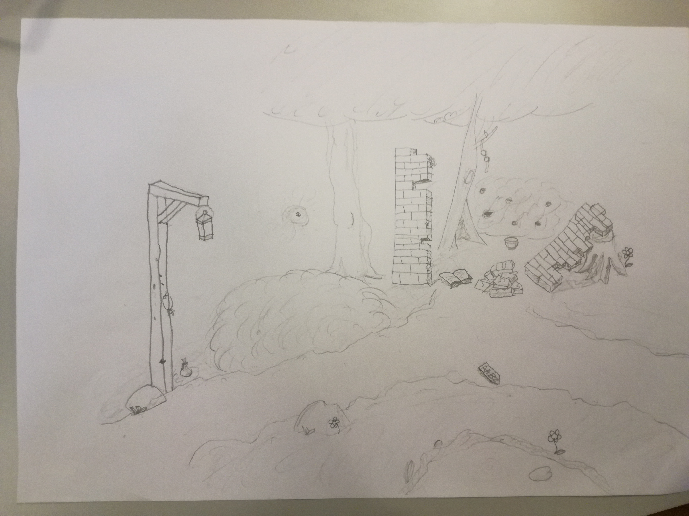
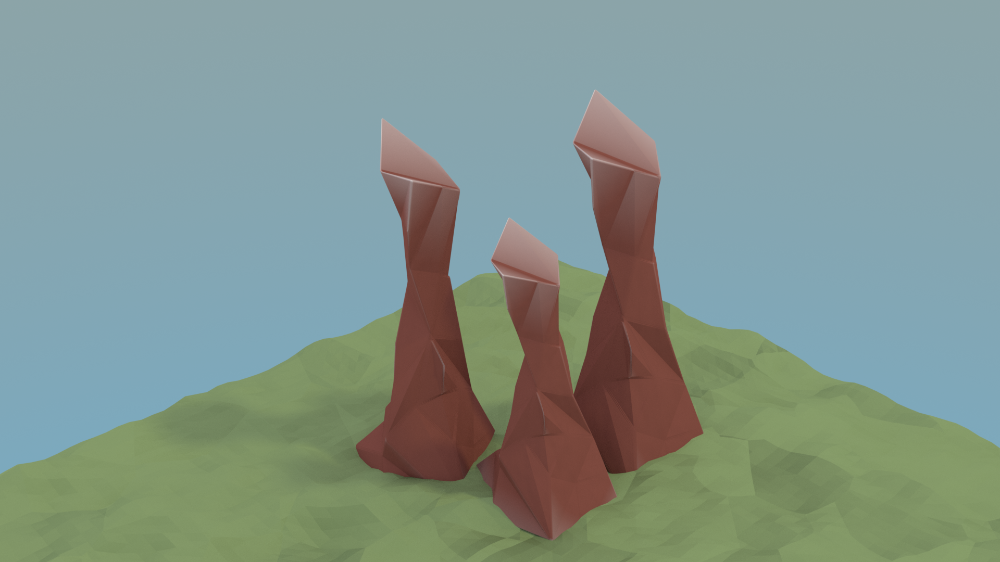

# Logbog


## 14/1 Fredag

I dag skitserede jeg den første tegning af spillet, for at få en idé om hvordan den generalle navigation skal fungere, og kom frem til at det vil være til gavn for spillet, hvis det foregår i 3D, i stedet for mine foregående tanker der hvor spillet var et 2D topdown spil.
Dette vil ikke have den store effekt på spillets gameplay, men vil åbne op for nogle interessante visuelle tricks der, bogstaveligt, vil tilføje ikke en men to dimensioner til oplevelsen.

En stor del af timen blev også brugt at diskutere med de andre hvad de forstod identitet som, hvor vi også diskuterede vores forskellige idéer. I en af disse samtaler, kom emnet om flere dimensioner op. Dette startede en idé hos mig. I kombination med at spillet nu var i 3D, kunne kameraet spille en stor rolle i hvordan spillet blev oplevet. Dette ville kunne udnyttes på mange planer, og specifikt hvis man begrænser spilleres navigation i level'et, kan man planlægge kamerarets bevægelse ned til den mindste detalje. Når man som designer har fuld kontrol over perspektivet verden bliver set fra, kan man manipulere med modtagerens opfattelse. Objekter kan strategisk placeres så de dækker over specifikke genstande, eller splitte viewporten i to. Det tænkes at ved at splitte viewporten, kan man have forskellige verdener på hver sin side. Dette kan være en grundlæggende gameplay funktion, og mine umiddelbare tanker er det kan være med til at introducere et dybere filosofisk- og psykologisk plan. Man bevæger sig mellem dimensioner og psykologiske planer på samme tid, på en form for Freudiansk måde.

Det tænkes at spillet er rumbaseret, og når man bevæger sig fra rum til rum, ændres dimensionen. Dette ville være interessant at udnytte, tag for eksempel en verden med tre rum, rum `A`, `B` og `C`, verdenen er illustreret nedenunder. Vi starter i rum `A+`, og vores mål er komme til `A-`, hvor fra vi kan gå til enten `B` eller `C`. Vi går til `C-`, hvorfra vi _kun_ kan gå til `B`, fra `B+` går vi til `A-`, samme lokation som vi startede, men nu i den negative dimension.

```
  Positive   |   Negative
   Verden    |    Verden
             |
      A      |      A
     / \     |     /
    B   C    |    B---C
```

Dette er et matematisk graf problem, og er videre uddybet i [denne video](https://www.youtube.com/watch?v=W18FDEA1jRQ).



*En skitse af et eksempel på en scene set i spillet*

Senere brugte jeg et par timer på at lære 3D-modellerings programmet [Blender](www.blender.org), da jeg der er essentielle koncepter og situationer i spillet der er bedst forstået som faktiske 3D animationer.


## 16/1 Mandag


## 18/1 Onsdag

Over weekenden, og i løbet af de to forrige dage udviklede jeg mine færdigheder i Blender, og prøver så småt på at modellere de mest essentielle objekter i min før skitserede scene, da jeg ønsker at kunne eksperimentere med kamera bevægelser, og andre eventuelle "æstetiske" gameplay features.



*Mit første forsøg på et mesh af et potentielt træ, uden dets krone.*


