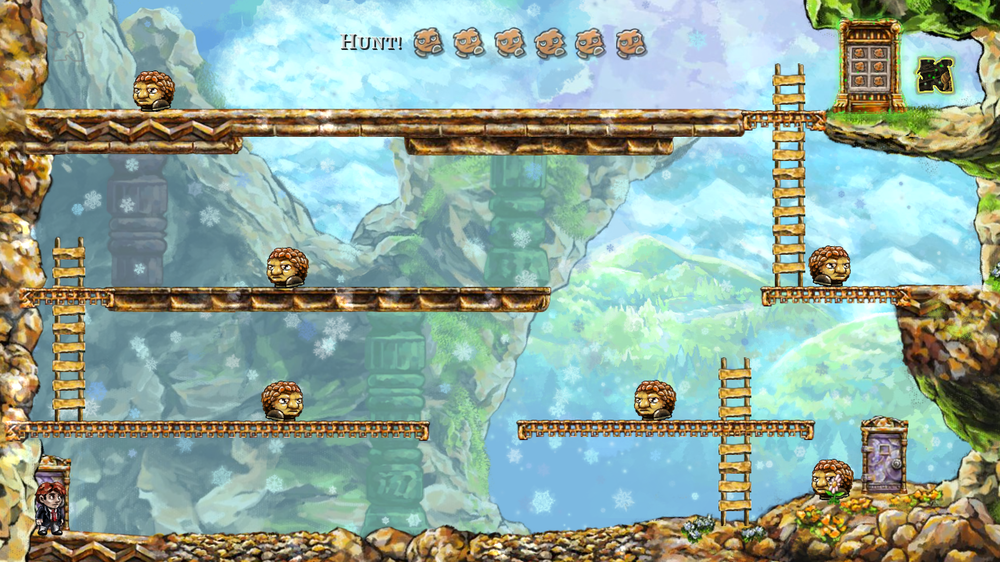
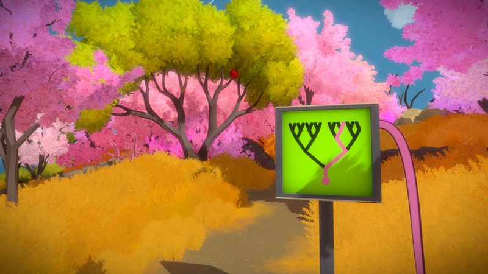
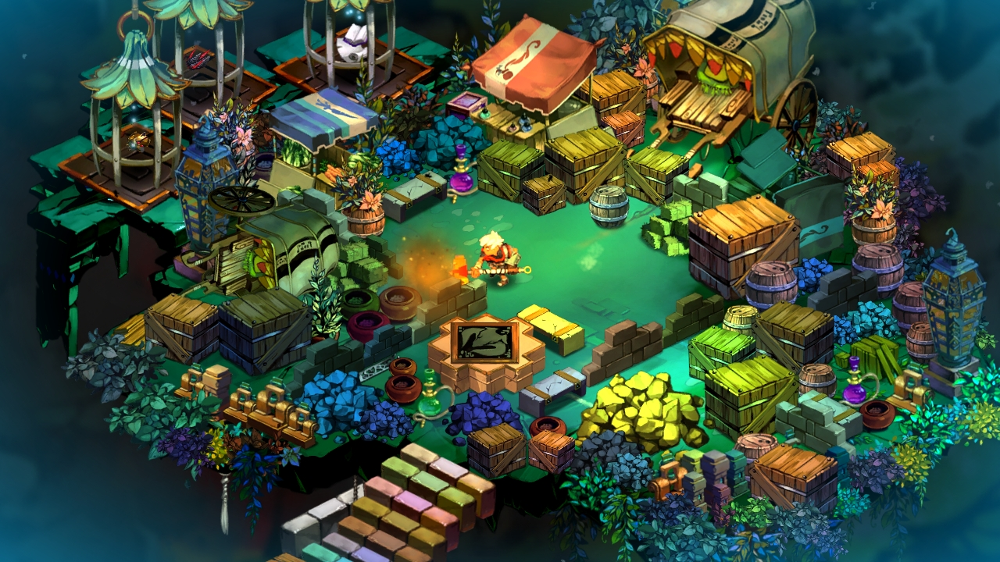

# Hjemme Opgave
_Design Projekt - Januar & Februar 2017_

**Forfatter:**

Oliver Bøving

**Emne:**

Game and Production Design

# Tidsplan

**Endelig aflevering:** 9/2

# Inspiration og influencielle tidligere værker
_Løbende opdatere igennem opgavens forløb_

## Braid
_2010 - Jonathan Blow_

I 2010 udgav Jonathan Blow spillet Braid, et spil han som ene mand havde designet. 2D sidescrolleren blev kendt for dets interessante og fantastisk udfordrerne leveldesign. Spillet fungerede som en katalysater for indie spil branchen, og satte kursen for fremtidens selvstendige spil udviklere. Hvad formålet for spilleren i Braid var, blev fortalt til spilleren, man starter lige som i det første Super Mario, kun med mulighed for at løbe mod højre. I spillet levels finder man disse puslespilsbrikker der ved hver verden danner et, på overfladen , maleri

## The Witness
_2016 - Jonathan Blow_

I spillet The Witness udgivet i 2016 ses et spil der på overfladen handler om at tegne streger

## Bastion
_2011 - Super Giant Games_

<audio
  src="./assets/Daniel Norgren - Whatever Turns You On (Studio Live)-gAWiQDHC_qo.mp3"
  autoplay>
</audio>

-gAWiQDHC_qo.mp3)

